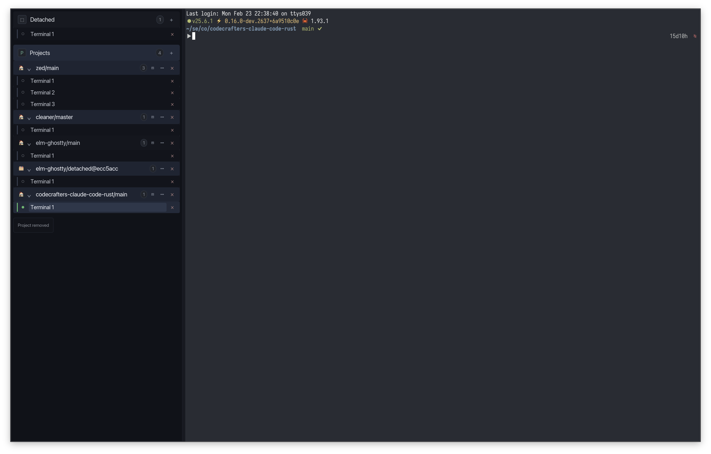
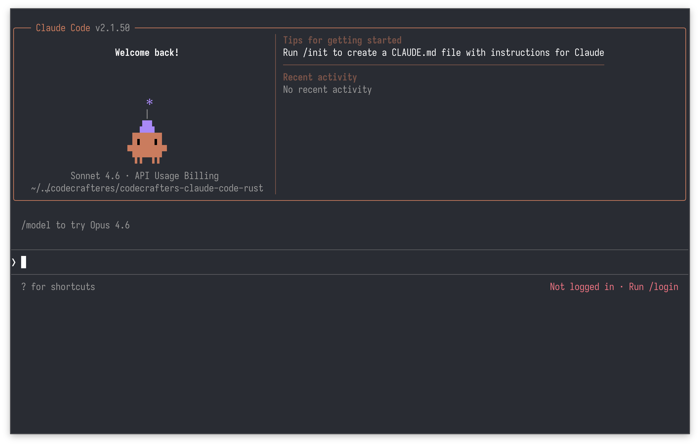
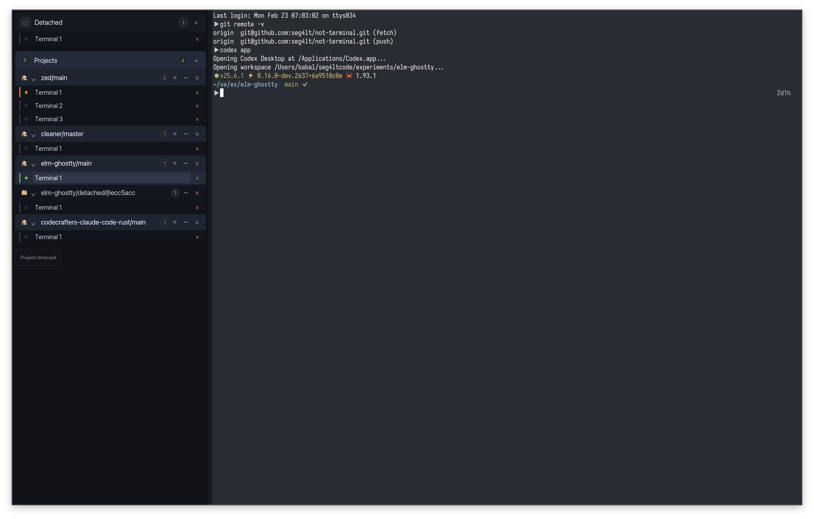
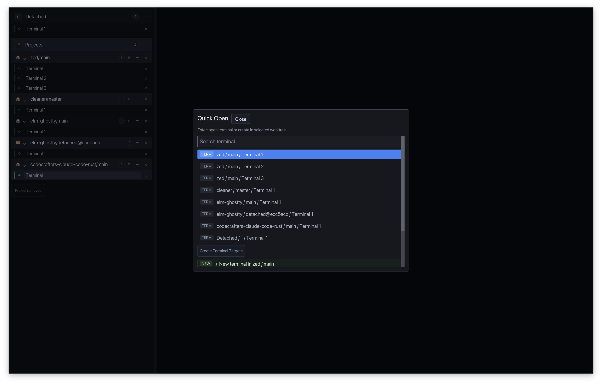
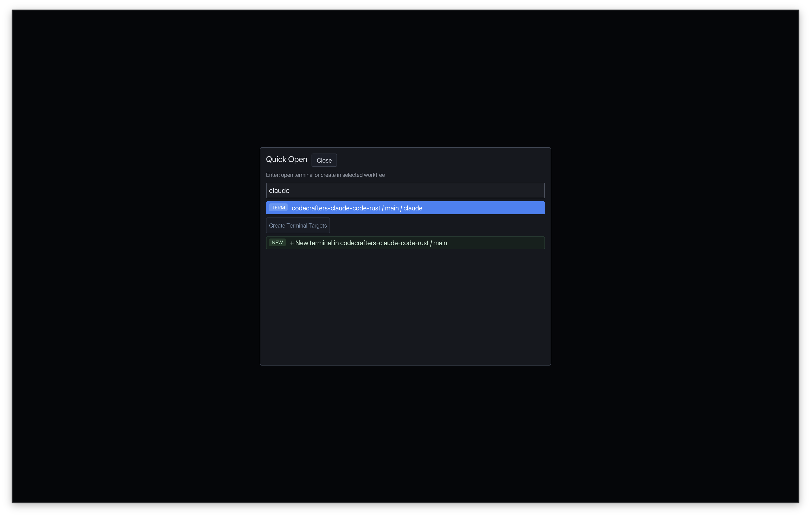
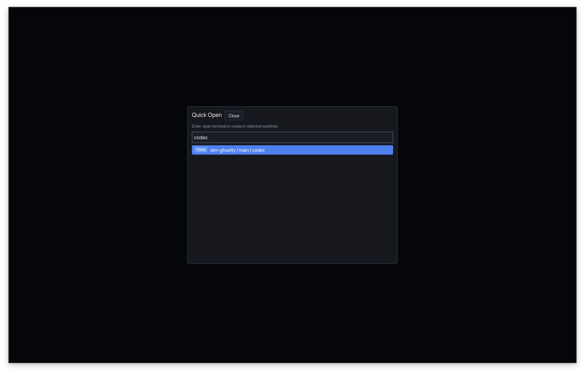
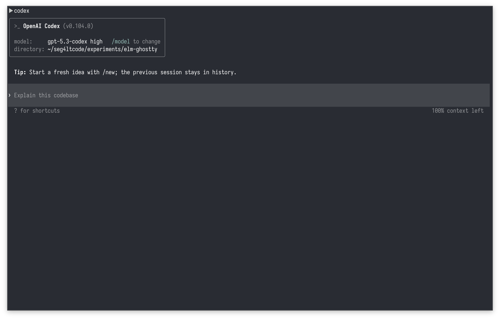
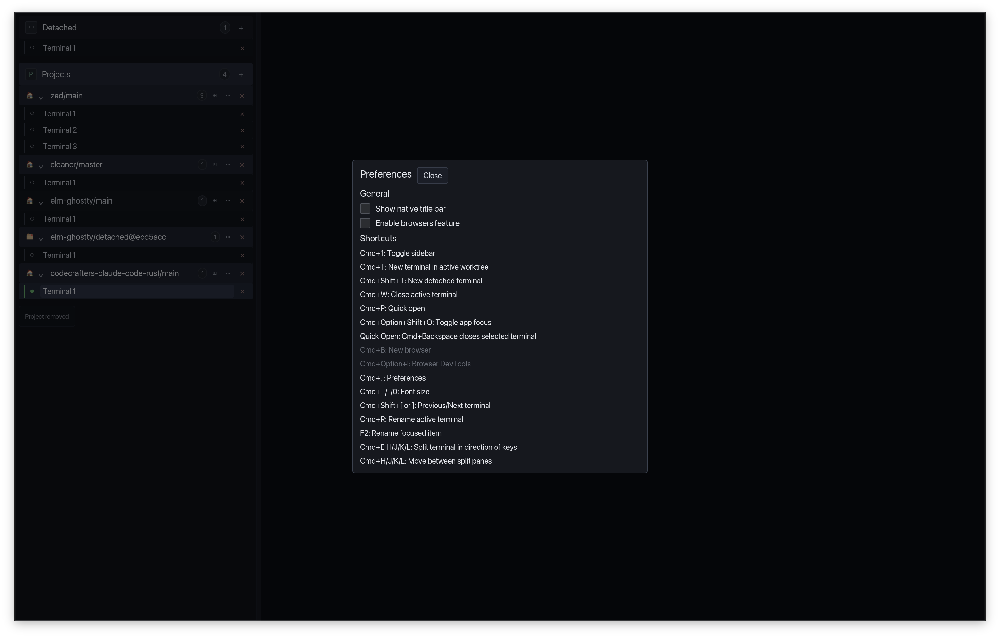

# not-terminal

Experimental macOS app that embeds Ghostty inside an Iced UI.

## What it does

- Sidebar for projects, worktrees, and terminals
- Embedded Ghostty terminal surface
- Quick switcher (`Cmd+P`)
- Preferences panel with shortcut reference (`Cmd+,`)
- Global focus toggle (`Cmd+Option+Shift+O`)

## Screenshots

### Main window



### Clean terminal view (`Cmd+1`)

`Cmd+1` hides the side panel for a clean, distraction-free terminal-only view (fullscreen-style).



### Notification indicator (agent waiting for reply)

Example of the terminal row showing a notification/status indicator while an agent is waiting for a response.



### Switcher (`Cmd+P`)

Quick Open acts as a terminal/worktree switcher.



### Open Claude from Quick Open (`Cmd+P`)

Filter by `claude`, press `Enter` to switch, then press `Enter` again to interact with the terminal.




### Open Codex from Quick Open (`Cmd+P`)

Filter by `codex`, press `Enter` to switch, then press `Enter` again to interact with the terminal.




### Command palette / shortcuts view (`Cmd+,`)

There is no separate command palette UI yet; the current shortcuts/commands reference is shown in Preferences.



## Notes

- Your Ghostty config should work here too, as long as a keybinding is not overridden by this app's shortcuts.
- `Cmd+Option+Shift+O` toggles app focus on macOS:
- If the app is in the background, it brings it to the foreground.
- If the app is already active, it switches back to the previously focused app.
- This is the shortcut that quickly pushes/pulls the app between background and foreground.

## Run

```bash
cargo run
```

## Build app bundle (macOS)

```bash
make app
```

This creates:

- `build/NotTerminal.app`

## Install (copy to Applications)

Copy/paste `build/NotTerminal.app` into your `/Applications` folder (Finder), or use:

```bash
cp -R build/NotTerminal.app /Applications/
```

macOS only (AppKit + Ghostty embedding).

Disclaimer: This project is ~90% AI-generated code, built with Codex and GPT-5.3 Codex High.
